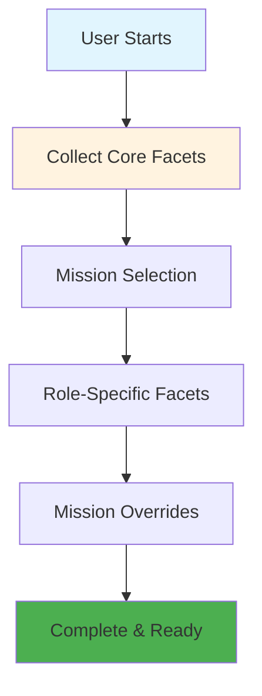
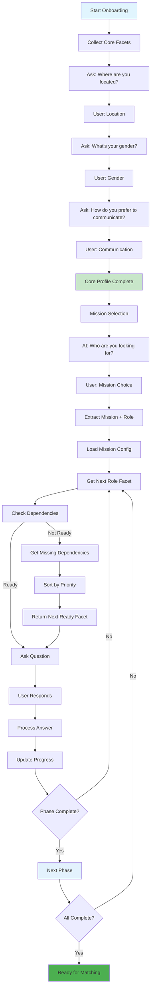
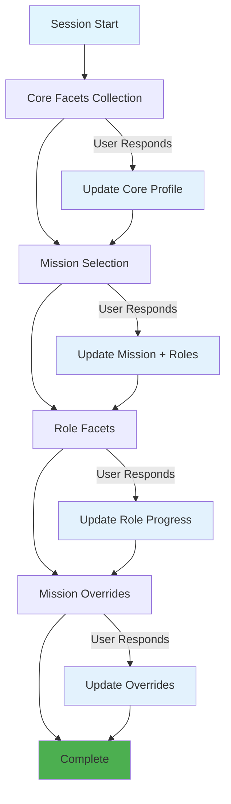
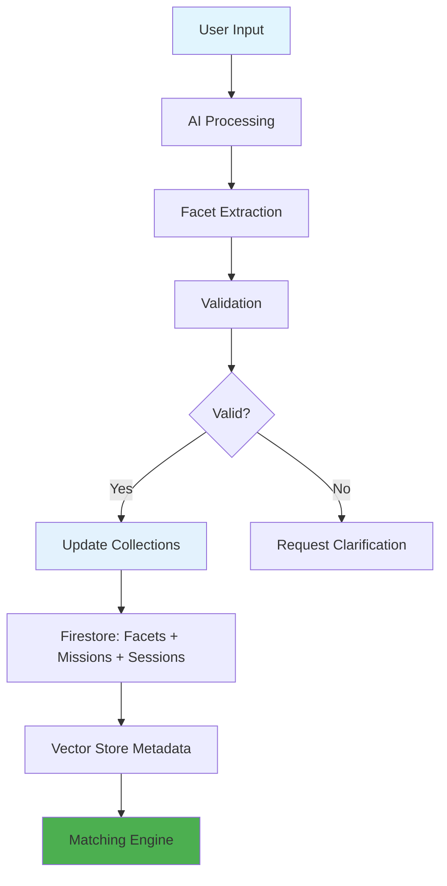
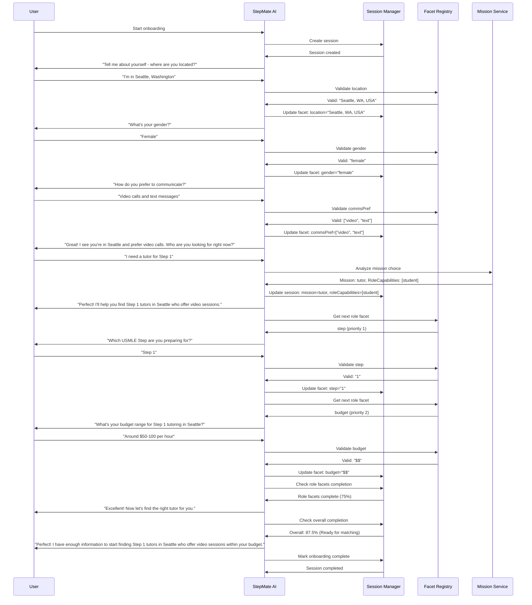
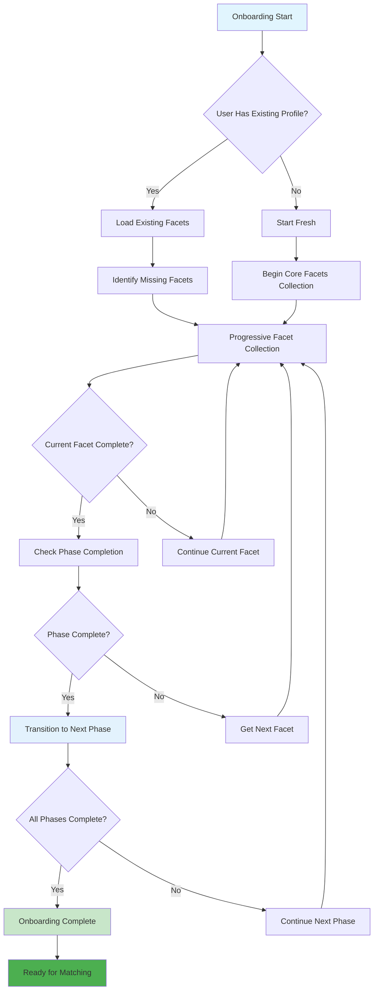
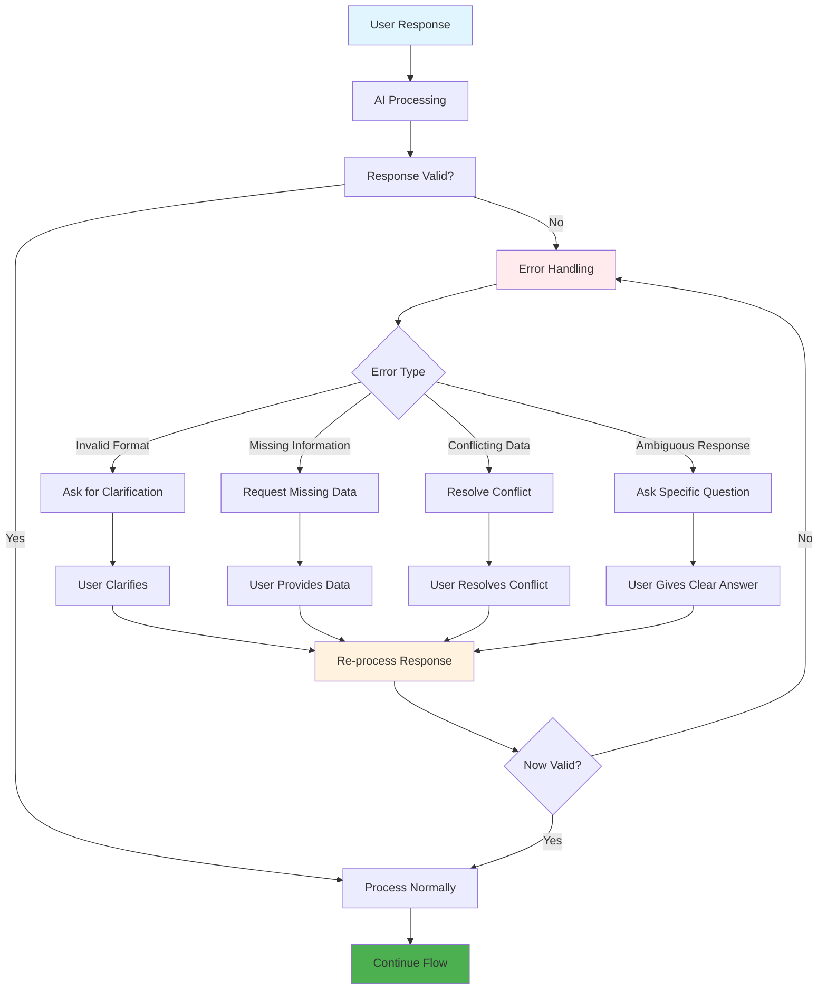

## StepMate Facet-Graph Onboarding Architecture

### 1. High-Level Onboarding Flow (Simplified)

### 2. Complete Question Flow (Combines Core, Mission, Dependencies)

### 3. Session State Transitions

### 4. Data Flow Architecture

### 5. Complete Onboarding Journey (Tutor mission → student capability)

### 6. Key Decision Points & Transitions

### 7. Error Handling & Recovery Flow

