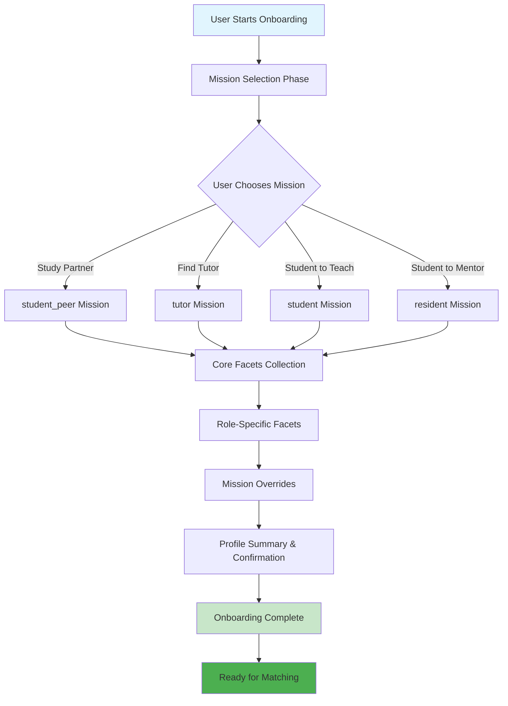
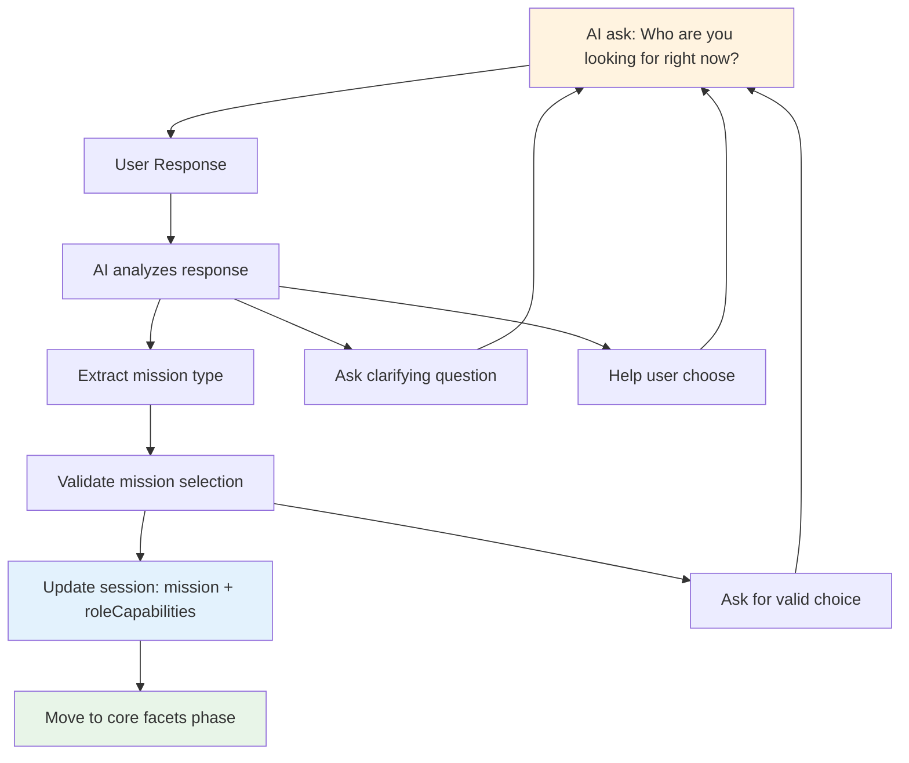
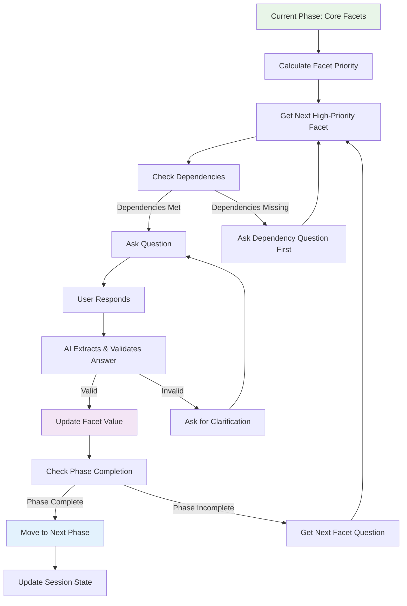
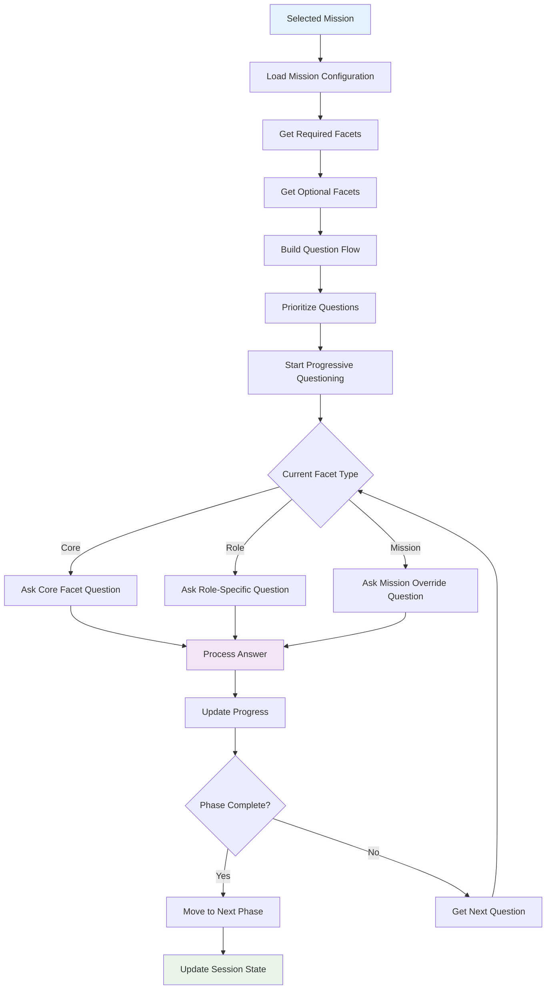
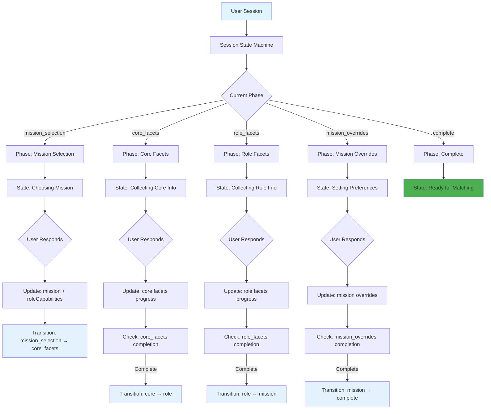
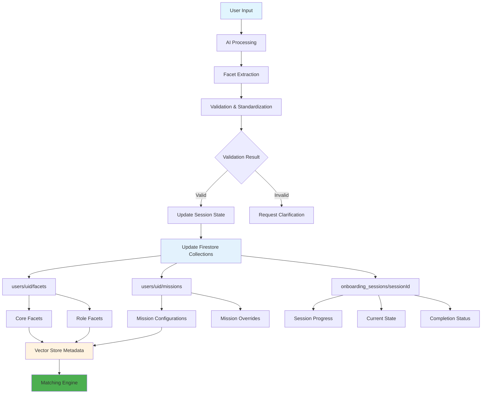
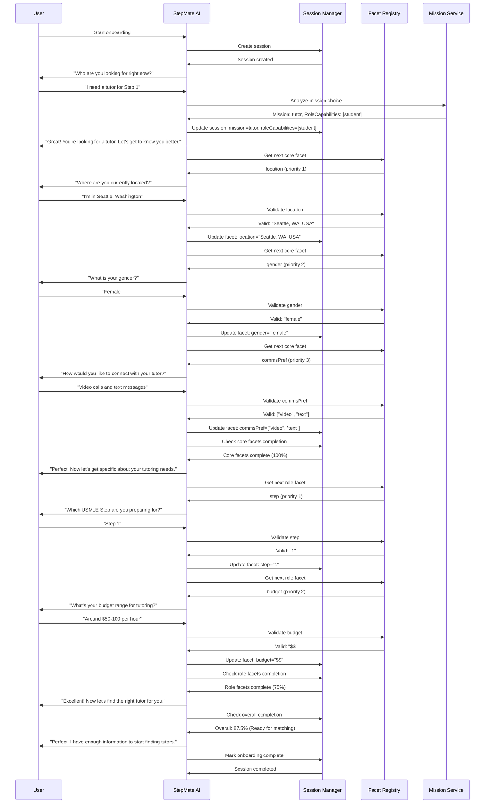
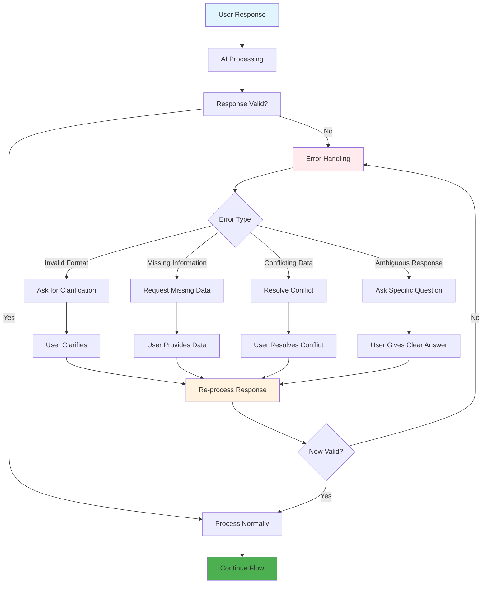

## StepMate Facet-Graph Onboarding Architecture

### 1. High-Level Onboarding Flow Architecture



### 2. Detailed Mission Selection Flow



### 3. Progressive Facet Collection Flow



### 4. Facet Dependency & Priority Flow

```mermaid
graph TD
    A[Facet Registry] --> B[Get Facet Dependencies]
    B --> C{Check Dependencies}
    C -->|No Dependencies| D[Ready to Ask]
    C -->|Has Dependencies| E[Check Dependency Status]
    E --> F{All Dependencies Met?]
    F -->|Yes| D
    F -->|No| G[Get Missing Dependencies]
    G --> H[Calculate Priority Score]
    H --> I[Sort by Priority]
    I --> J[Return Next Ready Facet]
    D --> J
    style A fill:#e1f5fe
    style J fill:#c8e6c9
    style G fill:#fff3e0
```

### 5. Mission-Specific Question Flow



### 6. Session State Management Flow



### 7. Data Flow & Storage Architecture



### 8. Complete Onboarding Journey (Tutor mission → student capability)



### 9. Key Decision Points & Transitions


### 10. Error Handling & Recovery Flow




