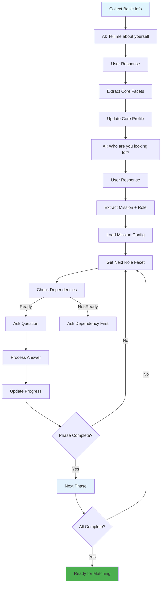
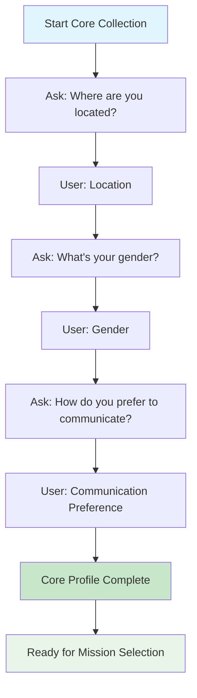
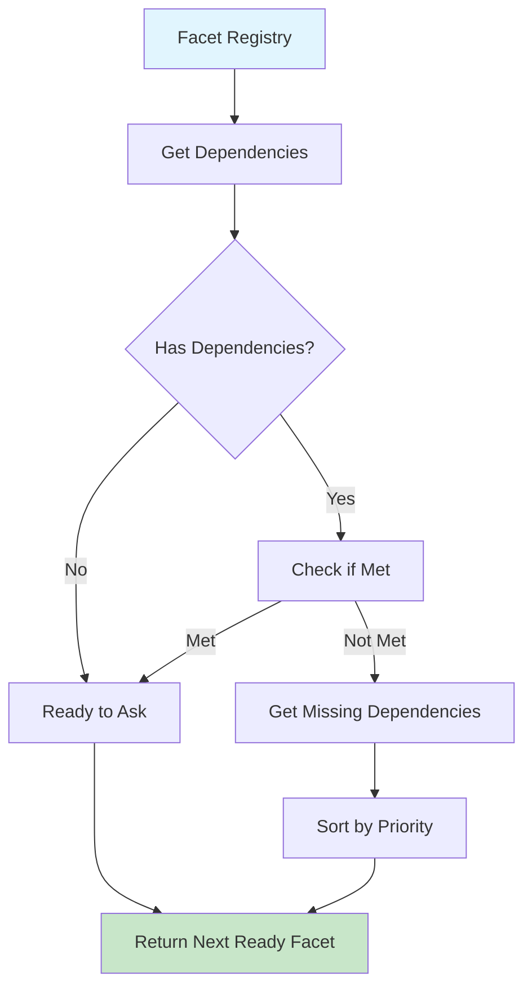

## StepMate Facet-Graph Onboarding Architecture

### 1. High-Level Onboarding Flow (Simplified)

### 2. Mission-Driven Question Flow (Combined)

### 3. Core Facets Collection

### 4. Facet Priority & Dependencies

### 5. Session State Transitions

### 6. Data Flow Architecture

### 7. Complete Onboarding Journey (Tutor mission → student capability)

### 8. Key Decision Points & Transitions

### 9. Error Handling & Recovery Flow

